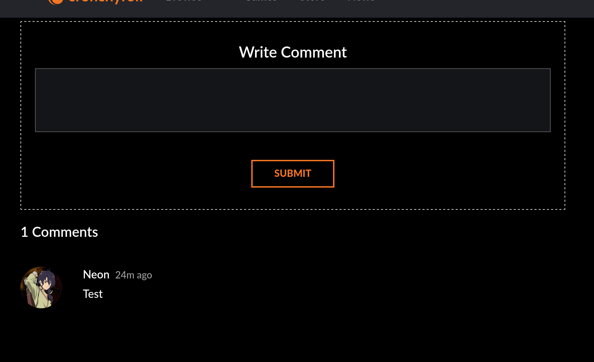

# Crunchyroll Comments/Reviews

An extension that adds crunchyroll comments functinality back.
This is an extension which replicates the comments on crunchyroll for how they used to look like (mostly). 
This is still a WIP and more features are on the way.

## More features
- Reviews
- Replying to a comment
- liking a comment
- Disliking a comment
- edit comment
- delete comment
- Reporting a Comment
- Custom comment badges
- comment automoderation (malicous viruses, spam, etc)
- safe mode (client size only filter)
- Episode syntax highlighting (ex: 00:01 jumps you to the first second of the video) (maybe comming)

## Helpful links
[Reddit post about removal of comments](https://www.reddit.com/r/Crunchyroll/comments/1dy380k/crunchyroll_removing_comments_reviews_etc/?utm_name=web3xcss)

[Wayback: Eps Comments](https://web.archive.org/web/20240614012147/https://www.crunchyroll.com/watch/GRG5JD92R/cruelty)

^ all css is sourced from there

[Waybacl: Reviews](https://web.archive.org/web/20240613225900/https://www.crunchyroll.com/series/GY5P48XEY/demon-slayer-kimetsu-no-yaiba)

## Privacy
this extension connects only to `api.saahild.com`. 
The data being transfered when your creating when a comment is:
- ID (crunchyroll acc identifier) (CANNOT be used to login/hack)
- Username (for comments)
- Avatar (for comments)

## 💰 You can help me by Donating
    
